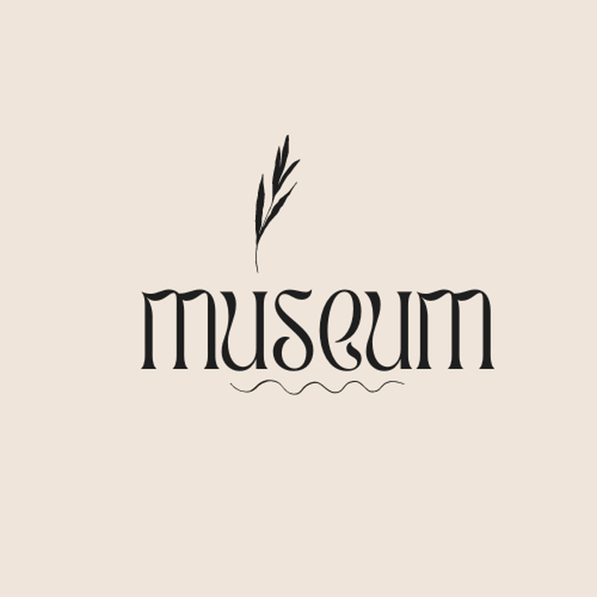
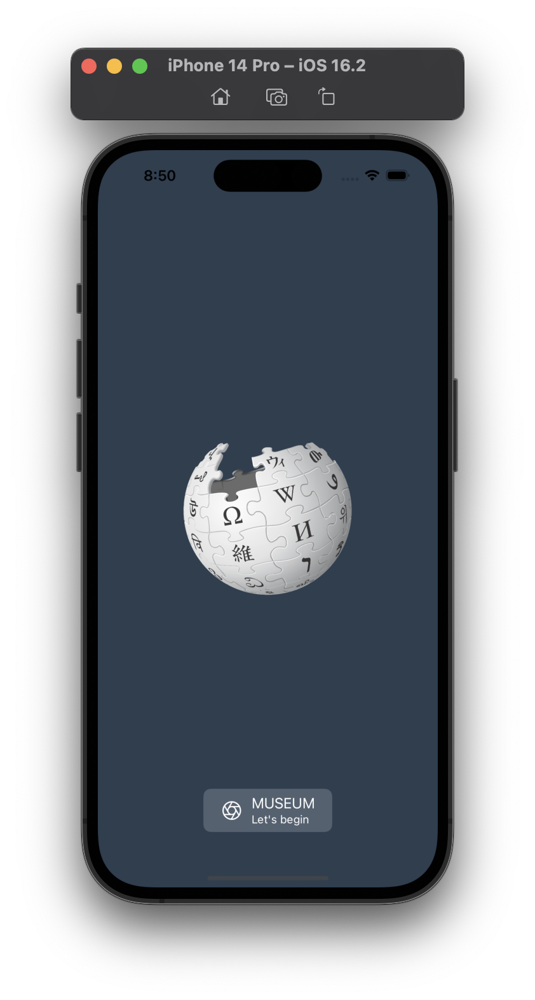
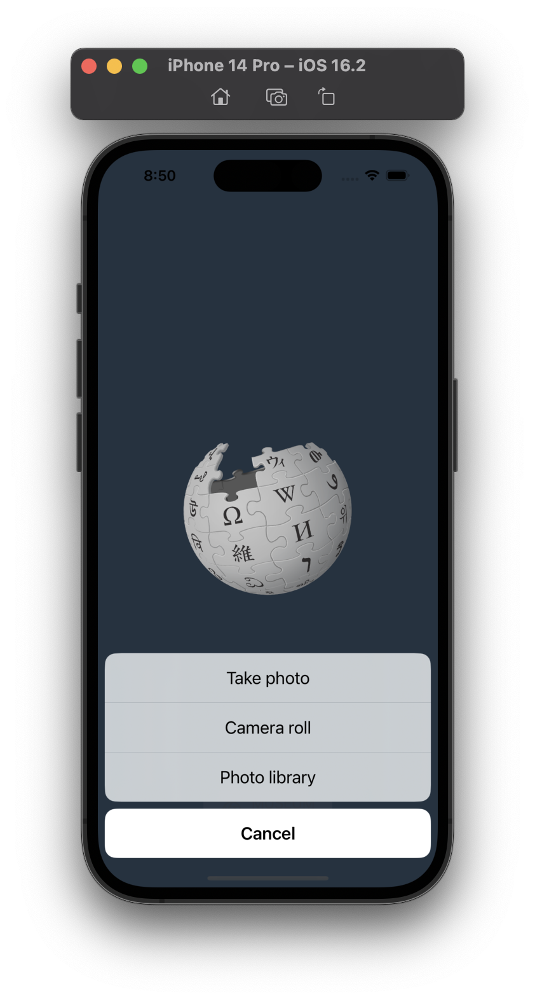
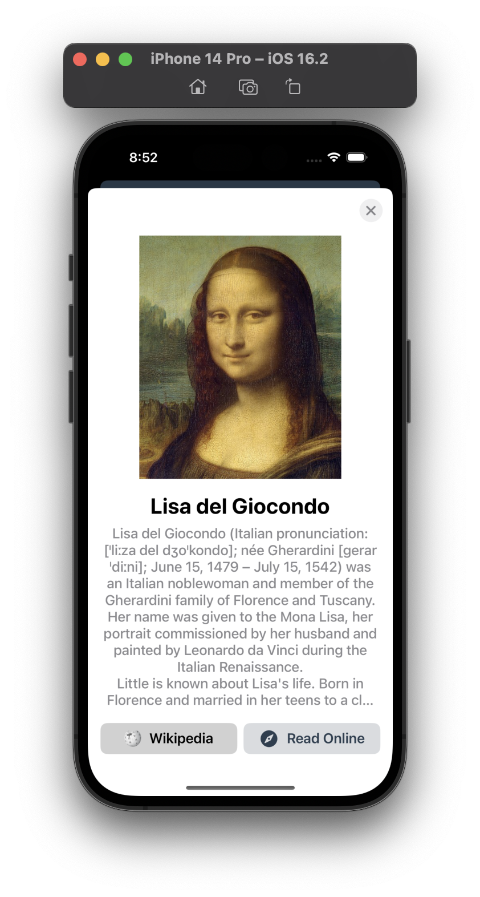
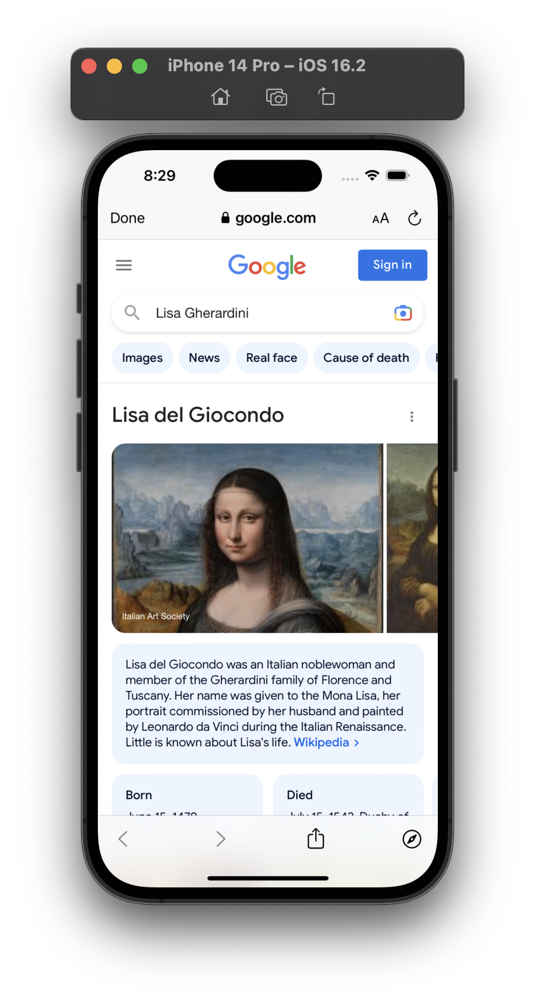

# Museum App (UIKit)

	

</a>

<a href="https://www.swift.org">

<a href="https://developer.apple.com/documentation/ios-ipados-release-notes/ios-ipados-16_2-release-notes">

	

## Features
- Take a photo by iPhone or choose a photo from photo library.
- Recognize from the screen-captured image that this is exactly this product (painting for example)
- Show user the view with the image of the painting and the brief info regarding that
- Provide the user with the ability to immediately search for a product using Google or search for it on Wikipedia

## Usage
- The user has the option to take a photo on the iPhone or choose a photo from the library

	

</a>

</a>

- Show the user a modal screen with the summary information found. 
- The user has the option to view detailed information from the Wiki or on the Internet.

	

</a>

</a>

## Architecture:
- Consideration of screen rotation
- MVP + Coordinator design pattern
- Dependency injection + SnapKit library Cocoapods
- Swift UIKit without storyboard

## Used API:
- [serpapi](https://serpapi.com)
- [imgur](https://api.imgur.com)
- [wikipedia](https://en.wikipedia.org/w/api.php)
